# Knowledge Graph Index

> Auto-generated by graphify. Start here — read community articles for context, then drill into god nodes for detail.

**725 nodes · 1242 edges · 57 communities**

---

## System Architecture Flowchart

```mermaid
flowchart TD
    C0["[Base & Base] Cluster (94 nodes)"]
    C1["[BaseModel & ValueError] Cluster (76 nodes)"]
    C2["[create_access_token() & Role] Cluster (65 nodes)"]
    C3["[get_settings() & upload_file()] Cluster (61 nodes)"]
    C4["[PromoCode & Payment] Cluster (59 nodes)"]
    C5["[authenticate_admin() & make_admin()] Cluster (37 nodes)"]
    C6["[FaqCategory & ContactMessage] Cluster (34 nodes)"]
    C7["[verify_stripe_signature() & payment_webhook()] Cluster (33 nodes)"]
    C8["[PassType & register_payload()] Cluster (32 nodes)"]
    C9["[send_email() & make_ticket()] Cluster (21 nodes)"]
    C10["[make_admin() & hash_password()] Cluster (15 nodes)"]
    C11["[ModelView & _has_permission()] Cluster (13 nodes)"]
    C12["[make_admin_with_role() & get_current_admin()] Cluster (10 nodes)"]
    C13["[form_fields() & open_call_for_partner()] Cluster (10 nodes)"]
    C14["[form_fields() & make_png_bytes()] Cluster (9 nodes)"]
    C15["Community 15 (9 nodes)"]
    C16["[payload() & open_call_for_ambassador()] Cluster (9 nodes)"]
    C17["[require_open_campaign() & set_window()] Cluster (8 nodes)"]
    C18["[payload() & open_call_for_exhibitor()] Cluster (8 nodes)"]
    C19["[make_user() & test_delete_me_anonymizes_and_revokes_token()] Cluster (8 nodes)"]
    C20["[run_async_migrations() & run_migrations_online()] Cluster (6 nodes)"]
    C21["[_make_test_app() & test_common_headers_always_present()] Cluster (5 nodes)"]
    C22["SecurityHeadersMiddleware & BaseHTTPMiddleware (5 nodes)"]
    C23["[_csv_response() & export_payments_csv()] Cluster (5 nodes)"]
    C24["Community 24 (5 nodes)"]
    C25["Community 25 (5 nodes)"]
    C26["make_speaker() & test_speakers_filter_by_theme_and_format_excludes_private() (5 nodes)"]
    C27["make_exhibitor() & test_exhibitors_excludes_private() (4 nodes)"]
    C28["Community 28 (4 nodes)"]
    C29["admin_users lockout columns  Revision ID: 5a30c6996bc8 Revises: 2c2d07493eb5 Cre (4 nodes)"]
    C30["referentials (days, pass_types, partner_levels, faq_categories)  Revision ID: e1 (4 nodes)"]
    C31["newsletter_subscribers table  Revision ID: c375ad4fa2bb Revises: 866edbae2931 Cr (4 nodes)"]
    C32["promo_codes, payments, tickets, waitlist  Revision ID: a3f8aaae2d58 Revises: 9dd (4 nodes)"]
    C33["users and user_profiles  Revision ID: 86b8fb32827d Revises: e15b192c81f5 Create (4 nodes)"]
    C34["campaign_windows  Revision ID: 2c2d07493eb5 Revises: a9e9ba5fc6f7 Create Date: 2 (4 nodes)"]
    C35["rbac (roles, permissions, role_permissions, admin_users)  Revision ID: a9e9ba5fc (4 nodes)"]
    C36["faqs, contact_messages  Revision ID: 3f306df50f16 Revises: 7b6712058249 Create D (4 nodes)"]
    C37["initial (empty)  Revision ID: 5e965f30353e Revises:  Create Date: 2026-08-25 21: (4 nodes)"]
    C38["speakers, ambassadors, partners, exhibitors  Revision ID: 7b6712058249 Revises: (4 nodes)"]
    C39["audit_logs table  Revision ID: 866edbae2931 Revises: 5a30c6996bc8 Create Date: 2 (3 nodes)"]
    C40["sessions  Revision ID: 9dd893772cc0 Revises: 86b8fb32827d Create Date: 2026-08-2 (3 nodes)"]
    C41["Community 41 (3 nodes)"]
    C42["Community 42 (3 nodes)"]
    C43["Community 43 (3 nodes)"]
    C44["Community 44 (2 nodes)"]
    C45["Community 45 (2 nodes)"]
    C46["Community 46 (1 nodes)"]
    C47["Community 47 (1 nodes)"]
    C48["Community 48 (1 nodes)"]
    C49["Community 49 (1 nodes)"]
    C50["Community 50 (1 nodes)"]
    C51["Community 51 (1 nodes)"]
    C52["Community 52 (1 nodes)"]
    C53["Community 53 (1 nodes)"]
    C54["Community 54 (1 nodes)"]
    C55["Community 55 (1 nodes)"]
    C56["Community 56 (1 nodes)"]
    C1 -->|22 edges| C3
    C1 -->|21 edges| C2
    C1 -->|13 edges| C6
    C2 -->|5 edges| C10
    C1 -->|5 edges| C4
    C3 -->|5 edges| C4
    C4 -->|4 edges| C3
    C2 -->|4 edges| C3
    C6 -->|4 edges| C3
    C3 -->|4 edges| C2
    C1 -->|3 edges| C19
    C2 -->|3 edges| C7
    C2 -->|3 edges| C9
    C6 -->|3 edges| C1
    C6 -->|3 edges| C8
    C3 -->|3 edges| C1
    C1 -->|3 edges| C12
    C5 -->|2 edges| C4
    C5 -->|2 edges| C1
    C1 -->|2 edges| C10
    C1 -->|2 edges| C8
    C3 -->|2 edges| C12
    C2 -->|2 edges| C1
    C8 -->|2 edges| C1
    C8 -->|2 edges| C5
    C9 -->|2 edges| C8
    C5 -->|1 edges| C7
    C5 -->|1 edges| C9
    C5 -->|1 edges| C8
    C4 -->|1 edges| C0
    C0 -->|1 edges| C8
    C1 -->|1 edges| C9
    C1 -->|1 edges| C25
    C1 -->|1 edges| C0
    C1 -->|1 edges| C5
    C0 -->|1 edges| C4
    C0 -->|1 edges| C7
    C8 -->|1 edges| C7
    C8 -->|1 edges| C2
    C7 -->|1 edges| C1
    C12 -->|1 edges| C4
    C4 -->|1 edges| C7
    C17 -->|1 edges| C1
    C4 -->|1 edges| C5
```

## Communities
(sorted by size, largest first)

- [[[Base & Base] Cluster]] — 94 nodes
- [[[BaseModel & ValueError] Cluster]] — 76 nodes
- [[[create_access_token() & Role] Cluster]] — 65 nodes
- [[[get_settings() & upload_file()] Cluster]] — 61 nodes
- [[[PromoCode & Payment] Cluster]] — 59 nodes
- [[[authenticate_admin() & make_admin()] Cluster]] — 37 nodes
- [[[FaqCategory & ContactMessage] Cluster]] — 34 nodes
- [[[verify_stripe_signature() & payment_webhook()] Cluster]] — 33 nodes
- [[[PassType & register_payload()] Cluster]] — 32 nodes
- [[[send_email() & make_ticket()] Cluster]] — 21 nodes
- [[[make_admin() & hash_password()] Cluster]] — 15 nodes
- [[[ModelView & _has_permission()] Cluster]] — 13 nodes
- [[[make_admin_with_role() & get_current_admin()] Cluster]] — 10 nodes
- [[[form_fields() & open_call_for_partner()] Cluster]] — 10 nodes
- [[[form_fields() & make_png_bytes()] Cluster]] — 9 nodes
- [[Community 15]] — 9 nodes
- [[[payload() & open_call_for_ambassador()] Cluster]] — 9 nodes
- [[[require_open_campaign() & set_window()] Cluster]] — 8 nodes
- [[[payload() & open_call_for_exhibitor()] Cluster]] — 8 nodes
- [[[make_user() & test_delete_me_anonymizes_and_revokes_token()] Cluster]] — 8 nodes
- [[[run_async_migrations() & run_migrations_online()] Cluster]] — 6 nodes
- [[[_make_test_app() & test_common_headers_always_present()] Cluster]] — 5 nodes
- [[SecurityHeadersMiddleware & BaseHTTPMiddleware]] — 5 nodes
- [[[_csv_response() & export_payments_csv()] Cluster]] — 5 nodes
- [[Community 24]] — 5 nodes
- [[Community 25]] — 5 nodes
- [[make_speaker() & test_speakers_filter_by_theme_and_format_excludes_private()]] — 5 nodes
- [[make_exhibitor() & test_exhibitors_excludes_private()]] — 4 nodes
- [[Community 28]] — 4 nodes
- [[admin_users lockout columns  Revision ID: 5a30c6996bc8 Revises: 2c2d07493eb5 Cre]] — 4 nodes
- [[referentials (days, pass_types, partner_levels, faq_categories)  Revision ID: e1]] — 4 nodes
- [[newsletter_subscribers table  Revision ID: c375ad4fa2bb Revises: 866edbae2931 Cr]] — 4 nodes
- [[promo_codes, payments, tickets, waitlist  Revision ID: a3f8aaae2d58 Revises: 9dd]] — 4 nodes
- [[users and user_profiles  Revision ID: 86b8fb32827d Revises: e15b192c81f5 Create]] — 4 nodes
- [[campaign_windows  Revision ID: 2c2d07493eb5 Revises: a9e9ba5fc6f7 Create Date: 2]] — 4 nodes
- [[rbac (roles, permissions, role_permissions, admin_users)  Revision ID: a9e9ba5fc]] — 4 nodes
- [[faqs, contact_messages  Revision ID: 3f306df50f16 Revises: 7b6712058249 Create D]] — 4 nodes
- [[initial (empty)  Revision ID: 5e965f30353e Revises:  Create Date: 2026-08-25 21:]] — 4 nodes
- [[speakers, ambassadors, partners, exhibitors  Revision ID: 7b6712058249 Revises:]] — 4 nodes
- [[audit_logs table  Revision ID: 866edbae2931 Revises: 5a30c6996bc8 Create Date: 2]] — 3 nodes
- [[sessions  Revision ID: 9dd893772cc0 Revises: 86b8fb32827d Create Date: 2026-08-2]] — 3 nodes
- [[Community 41]] — 3 nodes
- [[Community 42]] — 3 nodes
- [[Community 43]] — 3 nodes
- [[Community 44]] — 2 nodes
- [[Community 45]] — 2 nodes
- [[Community 46]] — 1 nodes
- [[Community 47]] — 1 nodes
- [[Community 48]] — 1 nodes
- [[Community 49]] — 1 nodes
- [[Community 50]] — 1 nodes
- [[Community 51]] — 1 nodes
- [[Community 52]] — 1 nodes
- [[Community 53]] — 1 nodes
- [[Community 54]] — 1 nodes
- [[Community 55]] — 1 nodes
- [[Community 56]] — 1 nodes

## God Nodes
(most connected concepts — the load-bearing abstractions)

- [[create_access_token()]] — 45 connections
- [[Base]] — 29 connections
- [[PassType]] — 29 connections
- [[User]] — 19 connections
- [[Role]] — 19 connections
- [[make_admin_with_permission()]] — 18 connections
- [[PromoCode]] — 17 connections
- [[Payment]] — 16 connections
- [[AdminUser]] — 16 connections
- [[get_settings()]] — 15 connections

---

*Generated by [graphify](https://github.com/safishamsi/graphify)*